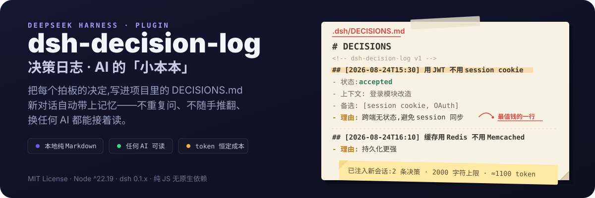
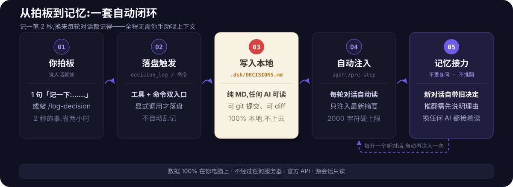

<p align="center">
  
</p>

---

## ✨ 它是什么?一句话讲透

> **这个插件是给 AI 干活时用的「会议纪要本」。** AI 每做一个重要决定(比如"用 A 方案不用 B 方案"),你让它记一笔,它就写进项目里的 `DECISIONS.md`。从此不管换新对话、换同事、还是过三个月回来看,**「当初为什么这么做」永远有据可查。**

它不是任务清单(那是 todo),不是聊天记录(那是 session),它是**项目的"决策记忆"**——代码的 git 记的是"改了什么",它记的是"为什么这么改"。

---

## 📌 使用前请先知道(30 秒读完)

**装好后,它不会在你界面上蹦按钮、蹦窗口、蹦面板。** 它是那种"藏在后台、随叫随到"的插件——需要**召唤**才干活。

- 第一次使用,会在你项目里**自动新建** `<项目>/.dsh/` 文件夹,放一份空白的 `DECISIONS.md`(只有表头,零条记录);
- **每次对话开始,dsh 里的 AI 都会先翻开这个小本本读一遍**(内容自动注入),所以就算一条都还没记,AI 也知道"有这么个本子"在记录决策;
- 平时它隐身:你该聊天聊天、该干活干活,界面上看不出它存在;
- **召唤它**——对 AI 说"**记一下:……**"或者敲 `/log-decision`,它立刻把这条决策连同上下文、理由**写进 `.dsh/DECISIONS.md`**;
- 记完继续隐身,等下一次召唤;
- 它还会主动做一件事:每轮对话开始时,把"已记录的决定"自动注入给 AI,让 AI 别忘事——**这是它唯一主动的动作**,除此之外一切都要你开口。

**存储位置:你电脑上,一个独立的 MD 文件夹,不上云。**

```
你的项目文件夹/
└── .dsh/                  ← 插件第一次使用自动新建
    └── DECISIONS.md       ← 所有决定都记在这(纯 MD,任何 AI 可读,可 git)
```

一句话记住它:**一个隐身的小秘书——你喊它才出来,它只做一件事:把"定了什么、为什么"记进你项目里的 MD 文件。**

---

## 🌍 一份 MD,任何 AI 都能读(这能力最被低估!)

你记下的 `DECISIONS.md` **不专属 dsh、不绑定任何一家 AI**——它就是一份最普通的 Markdown,放在你电脑上,路径固定、随时可访问:

- 🤖 **Claude 能读**——干活前让它"读一下 `<项目>/.dsh/DECISIONS.md`",立刻知道项目决策全貌
- 🤖 **Cursor 能读**——写代码前看一眼,不会写出跟你已定方案冲突的东西
- 🤖 **ChatGPT 能读**——把文件拖给它,马上进入状态
- 🤖 **任何 AI 都能读**——只要是能读 Markdown 的工具,都读得懂

为什么这很重要?因为你的决策记忆应该**跟着项目走、跟着文件走、跟着你自己走**——而不是跟着某一个 AI 的聊天记录走。今天用 dsh 干活,记的决策明天能用 Claude 续上;换工具、换 AI、换电脑,**文件还在,记忆就在**。

---

## 😫 这些场景,你熟不熟?

| 场景 | 痛点 |
|---|---|
| 🤖 **AI 的"失忆循环"** | 周一你让 AI 定了"登录用 JWT 不用 session cookie",聊了半小时敲定方案。周二新开对话继续——AI 一脸茫然:"请问登录方案选哪个?" |
| 🔍 **代码的"身世之谜"** | 三个月后看一段代码想:"这里为啥用 Redis 不用 Memcached?"翻聊天记录?早没了。问同事?没人记得。 |
| 🤝 **交接的"说不清楚"** | 任务要交接,人家问"这块为什么这么写",你只能憋出一句"呃……反正当时就这么定的"。 |
| 🎲 **AI 的"朝令夕改"** | 干到一半,AI 突然说"我觉得应该把方案推倒重来"——因为它**忘了你 20 分钟前刚拍板定下的方案**。 |

---

## 💡 装上它之后,同样的场景变成这样

| 之前 | 之后 |
|---|---|
| 新对话的 AI 失忆,重问一遍 | 新对话的 AI **自带记忆**:"之前定了用 JWT" |
| "为啥用 Redis" 没人知道 | 翻一眼 `DECISIONS.md`,**理由写得清清楚楚** |
| 交接时嘴巴说不清 | **直接把决策文件甩过去**,比嘴说清楚一百倍 |
| AI 中途想推翻方案 | 注入摘要提醒它:"历史已定,**勿重复讨论,推翻需先说明理由**" |

**一句话:花两秒记一笔,省未来两小时。**

---

## 📁 记下来的东西,长这样

文件在**项目文件夹**里的 `.dsh/DECISIONS.md`(每个项目一份,互不串门)。**插件第一次使用时会自动新建 `.dsh/` 文件夹并生成空白文件**(只有表头、零条记录),随时可以打开看:

```markdown
# DECISIONS
<!-- dsh-decision-log v1 -->

## [2026-08-24T15:30:00+08:00] 用 JWT 不用 session cookie
- 状态: accepted
- 上下文: 登录模块改造
- 备选: [session cookie, OAuth]
- 理由: 跨端无状态,避免 session 同步
- 涉及文件: [src/auth/session.ts]
- 来源: session-abc123 (seq 42)

## [2026-08-24T16:10:00+08:00] 缓存用 Redis 不用 Memcached
- 状态: accepted
- 理由: 持久化更强
```

**它就是一份普通 Markdown,所以你能:**

- 🤖 **给任何 AI 读**——让 Claude 干活前先读一遍,让 Cursor 写代码前先看一遍
- 🔄 **提交 git**——`git add .dsh/DECISIONS.md && git commit`,决策和代码一起版本化
- 📤 **交接甩文件**——新同事/新会话,直接把这份文件发过去,比嘴说清楚
- 🕰️ **回看演变**——`git log` 看这份文件的历史,"决策是怎么一步步变过来的"一目了然
- 🤝 **代码评审对照**——PR 讨论时,"当时为什么这么写"直接引用

> `--reason` 是最值钱的一行——**没它,这条记录就只是个标题,别人看了一头雾水**。

---

## 🚀 安装(一句话的事,剩下的交给 AI)

**把下面这段话整个复制,发给 dsh AI(或任何 AI 助手),它会自动帮你装好、重启、跑冒烟测试:**

```
帮我安装 dsh-decision-log 插件:
1. 运行 dsh plugin --profile web add github:yuyolin/dsh-decision-log
2. 重启 dsh Web UI(启动命令要带 --patch)
3. 跑冒烟测试:开一个会话,执行 /log-decision 测试,确认返回"决策已记录"
4. 把结果告诉我
```

> 如果你在**本地开发**这个插件,把第 1 步换成 `dsh plugin --profile web add "link:D:/dsh-decision-log"`。

**想自己动手?** 也完全可以:

```bash
# 1. 安装
dsh plugin --profile web add github:yuyolin/dsh-decision-log

# 2. 重启 Web UI(必须带 --patch,否则插件不生效)
npx @deepseek-ai/dsh web --patch

# 3. 验证:开个会话,输入
/log-decision 测试
```

看到"决策已记录"就说明它活了 ✅(这条测试记录留着或删掉都行)。

---

## 🎯 怎么用?简单到不像插件

### 玩法一:直接说人话(强烈推荐,什么也不用学)

把 AI 当成**随身带小本本的助理**。敲定一个决定,随口一句:

```
记一下:登录用 JWT 不用 session cookie
```

AI 秒懂,自己记好,还会回你:

```
✅ 决策已记录到 D:\work\myproject\.dsh\DECISIONS.md(当前共 3 条)
- 用 JWT 不用 session cookie(accepted)
- 理由:跨端无状态,避免 session 同步
```

**多举几个例子,全是大白话:**

- 🗣️ `把刚才选 X 方案的决定记下来`
- 🗣️ `记住,缓存用 Redis 不用 Memcached,因为持久化更强`
- 🗣️ `我们定好了:数据库用 PostgreSQL,记一下`
- 🗣️ `图表库用 ECharts 不用 AntV,记个档`

**什么时候说这句话?** 记住一个直觉:**凡是"我们最终选了哪个"这种话说出口,就补一句"记一下"**。两秒钟的事,未来省两小时。

### 玩法二:输入框敲命令(想自己记的时候)

```
/log-decision 用 Redis 不用 Memcached
```

想写详细点,带上背景和理由:

```
/log-decision 用 Redis 不用 Memcached --context 缓存层选型 --reason 持久化更强
```

| 参数 | 意思 | 例子 |
|---|---|---|
| `--context` | 在什么背景下做的决定 | `--context 缓存层选型` |
| `--reason` | 为什么这么选(**最值钱**) | `--reason 持久化更强` |
| `--status` | 状态,默认 `accepted` 不用管 | `--status superseded`(已推翻) |

**改主意了?** 不用删,补记一条,旧标 `superseded`(已推翻),保留完整历史:

```
/log-decision 缓存方案改为 Memcached --reason 团队更熟
/log-decision 用 Redis 不用 Memcached --reason 已换方案 --status superseded
```

### 玩法三:让 AI 记全套(信息量拉满)

```
把刚才的选型记一下,要带上备选方案和理由
```

AI 会记全:决策 / 背景 / 备选方案 / 理由 / 涉及文件——一条完整记录。

**记完随时可以查:**

- 📖 `查一下我们定过哪些事` —— 列出所有决策
- 🔍 `关于登录有没有什么决定?` —— 关键词搜索
- 🧹 `审计一下决策记录` —— 检查有没有记重、记乱
- 📄 `把决策文档导出来看看` —— 查看完整内容

---

## 🧠 最妙的部分:换了新对话,它自己就记得

这是最省心的设计——**你不用手动喂新对话**。

每次新对话、每轮新开始,插件都会**自动**把"已定过的事"塞给 AI 看,就像 AI 入职前先读了一遍项目手册:

```
📌 决策记录(历史已定,勿重复讨论,如需推翻请先说明理由):
- [accepted] 用 JWT 不用 session cookie — 跨端无状态,避免 session 同步
- [accepted] 缓存用 Redis 不用 Memcached — 持久化更强
(... 其余 1 条见 .dsh/DECISIONS.md)
```

**效果:**

- ✅ 新对话的 AI 天生知道旧决定,不再重复问
- ✅ AI 想推翻旧方案?得先说明理由——**防止随手推翻已定的事**
- ✅ 只注入最新几条 + 总数,**几乎不占 token**(默认上限 2000 字符)

**整套机制的闭环如下:**

<p align="center">
  
</p>

---

## 💰 说点实在的:它到底帮你省了什么?

| 你花的成本 | 你省下的 |
|---|---|
| 每次说完"定了用 X"补一句"记一下"(2 秒) | 新对话重讲一遍方案(10 分钟) |
| 敲一行 `/log-decision`(5 秒) | 三个月后翻聊天记录找"为什么"(半小时,还找不到) |
| 一次交接把文件甩过去(1 分钟) | 交接时反复口述背景(一下午) |
| 几乎为 0 的 token 成本 | AI 反复推翻已定方案带来的返工(无限) |

**这不是"锦上添花"的插件,这是"省心"的插件——装一次,用一年。**

---

## 🔬 老实交代:越用越久,token 会越来越重吗?

先说结论,别慌:**不会。** 用一年和用一天,每轮对话多花的 token 基本一个样。下面把账摊开算给你看。

### 核心就一条

插件**从来不把整本 `DECISIONS.md` 塞给 AI**——真要那样,记个一年肯定爆。它的做法特别朴素,就三步:

1. 每轮对话开始,只挑文件里**最新的一批**决策给 AI 看(不是全部);
2. 攒到 **2000 字符**就打住,多出来的不看了,只留一行小字:`(... 其余 N 条见 .dsh/DECISIONS.md)`;
3. 想看全部?随时喊 `decision_list` 按需查,或者直接打开文件——**完整内容永远躺在文件里,从不进对话**。

打个比方:就像你读书,每次开工前只看**目录最新那几页**,而不是把整本书背进脑子里。书随时能翻,但平常就放那儿,不占你脑子。

### 实测数据(真的跑过,不是编的)

| 记了多少条 | 每轮注入多少 | 实际 token |
|---|---|---|
| 100 条 | ~2060 字符(触顶了) | ≈ **1097** |
| 1000 条 | ~2039 字符(还是触顶) | ≈ **1075** |

看见没?从 100 条干到 1000 条,翻了十倍,每轮消耗反而**几乎没动**——因为它早就触顶了,再多也不看了。这就是"恒定成本":**本子不管记多厚,AI 每轮只看固定大小的一页。**

### 这点成本,值不值?

1100 token 是个什么概念?AI 正常回你一段话,动辄就是 1000~3000 token。也就是说,插件注入的这点东西,**约等于 AI 多说一两句话的功夫**。但你换来的是:

- 不用每次重讲背景,省下几百上千 token;
- 不会因为 AI 失忆而返工,可能省下几万 token 的重做成本;
- 决策可查可审计,团队协作不再靠嘴,没法用 token 算但肯定值。

**花 1100 token 买保险,避免 N 倍的返工费——这笔账,怎么算都划算。**

> **本子可以越记越厚,但 AI 每轮只看固定的一页。** 该花的一分不多花,不该花的一分不少省。放心用,越用越值!

---

## ❓ 常见问题

**Q:装好了但没反应?**
A:三步检查:① 启动命令带没带 `--patch` ② 重启没重启 ③ `/log-decision 测试` 有没有返回。

**Q:我说"记一下",AI 没记?**
A:先确认插件装好(见上)。装好了还不记,就明说"用 decision_log 工具记录"引导它。

**Q:记错了能改吗?**
A:不用改文件。补记一条新的,旧标 `superseded`(已推翻),保留完整历史。

**Q:两个项目会记混吗?**
A:不会。每个项目各有一份 `.dsh/DECISIONS.md`,完全隔离。

**Q:会很烧 token 吗?**
A:不会,每轮只注入最新几条摘要(2000 字符硬上限),**记录 100 条和 1000 条消耗几乎一样**(实测约 1100 token)。完整账本见上文《🔬 老实交代》。

**Q:这跟 todo、跟聊天记录有啥区别?**
A:todo 是"接下来做什么",聊天记录是"说过什么",决策日志是"**定了什么、为什么**"——是项目的决策资产,随代码版本化、可 diff、可交接。

---

## 🛡️ 权限与安全

- 只读写**当前工作区**的 `.dsh/DECISIONS.md`,以当前 dsh 进程权限运行
- **只读源会话**:从 `exec.agent.session` 读取元数据,绝不改写会话日志
- 自动识别只输出"候选"日志,**不自动落盘**——落盘必须经 `decision_log`(模型或用户显式触发)
- 不触发任何高危操作(无删除、无远程调用、无 shell 执行)

## 📦 兼容性

- Node.js: ^22.19.0 || >=24.0.0
- dsh: 0.1.x(官方 API:`agent.session`、`ctx.fs`、`agent/pre-step`、`session/event`)
- 纯 JS,无原生二进制依赖,Windows / Linux / macOS 通吃

## 🛠️ 开发

```bash
npm install
npm run build     # esbuild 编译到 lib/
npm test          # node --test(store/extractor/audit 纯逻辑测试)
```

## 🗺️ 路线图

- [x] Phase 1: MVP —— decision_log 手动记录 + 落盘 + 查询 + 审计 + 注入摘要
- [ ] Phase 2: 自动识别决策候选增强(LLM 蒸馏理由)+ Web UI 投影
- [ ] Phase 3: 跨会话语义去重(ctx.sessionQuery)+ git commit 关联

---

## 👋 关于作者

嗨,这个插件是我(**yuyolin**)瞎折腾出来的。

我平时就爱捣鼓 DeepSeek Harness 这玩意儿,因为它"什么都能当插件装"这个思路我特别喜欢。做这个决策日志的起因也简单:我受够了每次换个对话,AI 就跟失忆了一样,之前定好的事全得重讲一遍,烦死了。所以干脆自己写个插件,让 AI 记住"咱当初是咋定的"。

我还在 dsh 那边折腾了俩别的,感兴趣的也可以翻翻:

- **dsh-task-bootstrap**(拖即续):活干到一半想换对话?打包带走,接着干
- **dsh-drag-handoff**:直接把任务卡拖进新对话,fork 个新上下文

用着爽不爽、哪里卡壳、想要啥新功能,甚至想拉着我一起搞点新活——都欢迎来戳我:

- 📮 邮箱:**yuyolin9@gmail.com**
- 🐙 GitHub:[yuyolin](https://github.com/yuyolin)

每条消息我都会看,别客气,直接来。

## 📄 License

MIT — 自由使用,欢迎提 PR、提 issue、点 star ⭐
